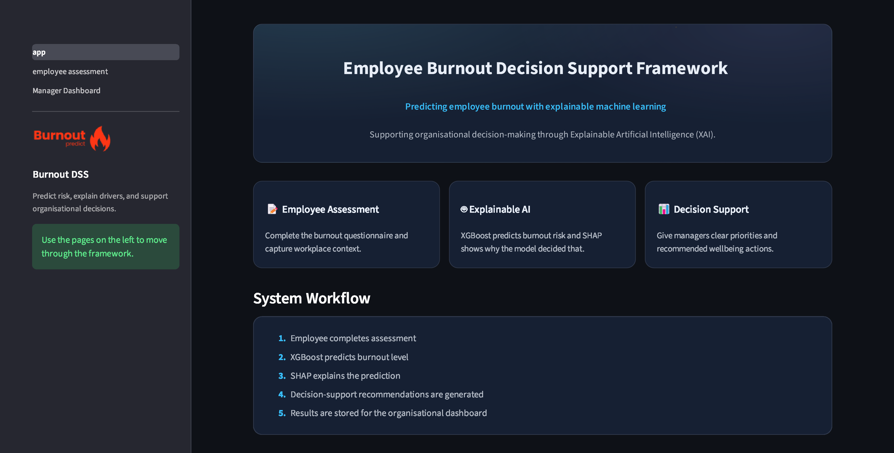
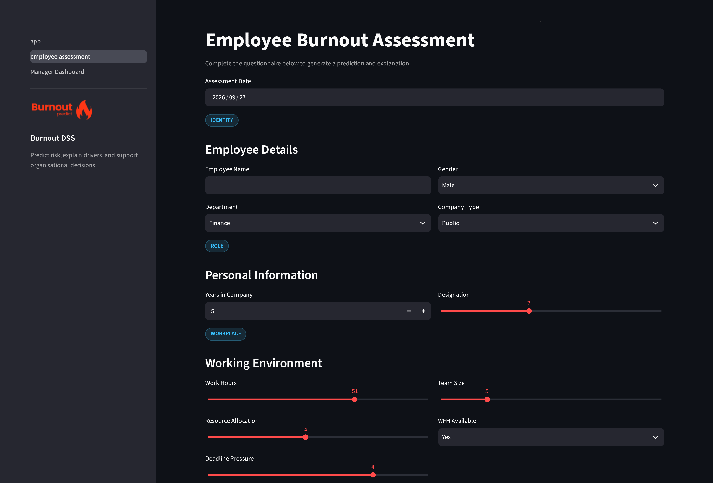
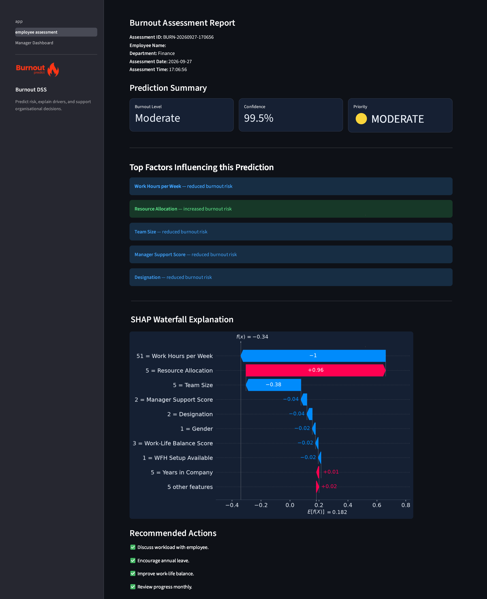
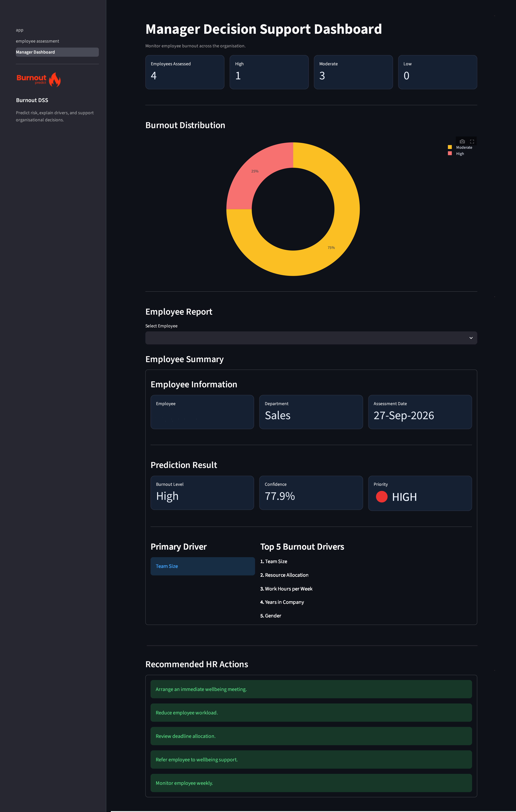

# Employee Burnout Decision Support Framework

A web-based decision-support application accompanying the MSc Data Science dissertation *"Predicting Employee Burnout Using Explainable Machine Learning Models: A Decision Support Framework for Organisational Decision-Making"* (Abednego Japhet).

The application classifies employee burnout risk (**Low**, **Moderate**, **High**) using a trained XGBoost model and explains each prediction using SHAP (SHapley Additive exPlanations), translating the output into decision-support recommendations for managers.

This README documents the code and application submitted alongside the dissertation. It does not restate the full methodology — see the dissertation itself (Chapter 3, Practical Research Methodology; Appendix D, Key Code Extracts) for the complete rationale behind data preprocessing, model development and evaluation.

---

## 1. Project Structure

```
.
├── app.py                          # Landing page (Streamlit entry point)
├── pages/
│   ├── 1_employee_assessment.py    # Assessment form, prediction, explanation, recommendations
│   └── 2_Manager_Dashboard.py      # Organisational dashboard, employee search, CSV export
├── screenshots/
│   ├── landing-page.png            # Landing page
│   ├── employee-assessment.png     # Employee assessment
│   ├── employee-assessment-report.png # Employee assessment report
│   └── manager-dashboard.png       # Manager dashboard
├── utils/
│   ├── __init__.py
│   ├── predictor.py                # Loads the trained model and returns predictions
│   ├── shap_utils.py               # SHAP explanation and waterfall plot generation
│   ├── recommendations.py          # Maps burnout level to decision-support recommendations
│   ├── storage.py                  # Persists each assessment to data/predictions.csv
│   └── ui.py                       # Shared styling and sidebar
├── models/
│   ├── xgb_burnout_model.pkl       # Trained XGBoost classifier
│   ├── label_encoder.pkl           # Encodes/decodes the Low/Moderate/High target
│   ├── feature_names.pkl           # Ordered list of the 14 model input features
│   └── shap_explainer.pkl          # Fitted SHAP TreeExplainer
├── data/
│   ├── employee_dataset.csv        # Raw dataset (Devkar, 2025 — Harvard Dataverse)
│   ├── employee_burnout_processed.csv  # Cleaned/encoded dataset used for model training
│   └── predictions.csv             # Assessment records generated by the app at runtime
├── scripts/
│   └── setup_libomp.py             # macOS-only helper: vendors libomp for XGBoost
├── .streamlit/
│   └── config.toml                 # Streamlit theme and server configuration
├── burnout_predict.ipynb           # Model training notebook (data prep, EBM/XGBoost, SHAP)
└── requirements.txt
```
## Screenshots

### Landing Page


### Employee Assessment


### Employee Assessment Report


### Manager Dashboard


> **Note:** the folder layout above (`pages/`, `models/`, `data/`, `.streamlit/`, `scripts/`) reflects where each file belongs when running the app locally. Place the uploaded files into these folders before running, as described in Section 3.

---

## 2. Requirements

- Python 3.10+
- Dependencies listed in `requirements.txt`:

```
streamlit>=1.32
pandas>=2.0
numpy>=1.24
plotly>=5.18
joblib>=1.3
shap>=0.44
xgboost>=2.0
matplotlib>=3.8
scikit-learn>=1.3
```

Install with:

```bash
pip install -r requirements.txt
```

---

## 3. Running the Application

1. Arrange the submitted files into the structure shown in Section 1 (in particular, the four `.pkl` files must sit inside a `models/` folder, and `1_employee_assessment.py` / `2_Manager_Dashboard.py` inside a `pages/` folder, for Streamlit's multipage routing and the `utils.predictor` model-loading path to resolve correctly).
2. From the project root, run:

```bash
streamlit run app.py
```

3. The app opens in the browser. Use the sidebar to navigate between **Employee Assessment** and **Manager Dashboard**.

### macOS users (XGBoost / libomp)

XGBoost requires the OpenMP runtime (`libomp`), which is not always present on macOS. If the app raises an error mentioning `libomp` or `OpenMP` when loading the model, run:

```bash
python scripts/setup_libomp.py
```

This vendors the required `libomp.dylib` into the installed XGBoost package so the model can load without a separate Homebrew installation.

---

## 4. Application Workflow

1. **Employee Assessment** (`pages/1_employee_assessment.py`) — the user enters administrative details (Employee Name, Department, Assessment Date — not used by the model) and 14 predictor values covering demographic, role, workplace and wellbeing factors.
2. **Prediction** — `utils/predictor.py` loads the trained XGBoost model and returns a burnout-risk classification (Low/Moderate/High) with a confidence score.
3. **Explanation** — `utils/shap_utils.py` generates SHAP values for the submitted assessment, producing a top-5 feature importance chart and a waterfall plot for the specific prediction.
4. **Recommendations** — `utils/recommendations.py` maps the predicted risk level to a priority flag and a short list of suggested actions.
5. **Recording** — `utils/storage.py` appends the full assessment, prediction, explanation and recommendation to `data/predictions.csv`.
6. **Manager Dashboard** (`pages/2_Manager_Dashboard.py`) — provides an organisational view: burnout distribution, average prediction confidence, per-employee search and report, aggregate burnout drivers, and CSV export of all recorded assessments.

---

## 5. Model Input Features

The trained model uses exactly 14 predictors (see `models/feature_names.pkl` for the exact order required by the model):

| Feature | Type | Notes |
|---|---|---|
| Gender | Categorical (0/1) | |
| Company Type | Categorical (0/1) | |
| WFH Setup Available | Categorical (0/1) | |
| Designation | Ordinal (0–5) | Category meanings undocumented in the source dataset |
| Years in Company | Numeric | Trained on a narrow observed range (16–17); app permits 0–17 |
| Work Hours per Week | Numeric | Matches the full training range (35–59) |
| Resource Allocation | Numeric (1–10) | |
| Deadline Pressure Score | Numeric (1–5) | |
| Team Size | Numeric | Trained range 3–19; app permits 1–20 |
| Mental Fatigue Score | Numeric (0.0–10.0) | |
| Sleep Hours | Numeric (3.4–9.1) | Matches the full training range |
| Work-Life Balance Score | Numeric (1–5) | |
| Manager Support Score | Numeric (1–5) | |
| Recognition Frequency | Numeric (0–5) | |

Values entered outside the training-data range (Years in Company, Team Size) should be treated as extrapolated rather than empirically validated predictions — see the dissertation's Limitations section (Chapter 5) for the full discussion.

---

## 6. Notebook

`burnout_predict.ipynb` contains the complete model-development pipeline: data cleaning, missing-value imputation, exploratory analysis, target categorisation (Low/Moderate/High via the 33rd/67th percentiles of Burn Rate), EBM and XGBoost training, hyperparameter optimisation, cross-validation, evaluation, and SHAP explainability. Selected extracts of this notebook are reproduced in Appendix D of the dissertation; this notebook is the full, runnable source.

---

## 7. Important Notes

- **Not a diagnostic tool.** Predictions represent data-derived burnout-risk classifications, not clinical diagnoses. The underlying Burn Rate target's psychometric origin is undocumented in the source dataset (see dissertation, Chapter 5, Limitations).
- **Decision support, not automated decision-making.** Predictions are intended to inform managerial and HR judgement, not to replace it. No prediction should be used as the sole basis for recruitment, promotion, disciplinary action or dismissal.
- **Data source.** The training dataset is Devkar, P. (2025) *Burnout Among Corporate Employees*, Harvard Dataverse, V1, https://doi.org/10.7910/DVN/VG6KQD.

---

## 8. Author

Abednego Japhet — MSc Data Science
Dissertation supervisor: Dr. [confirm spelling: Yongqiang / Yongquiang] Cheng
